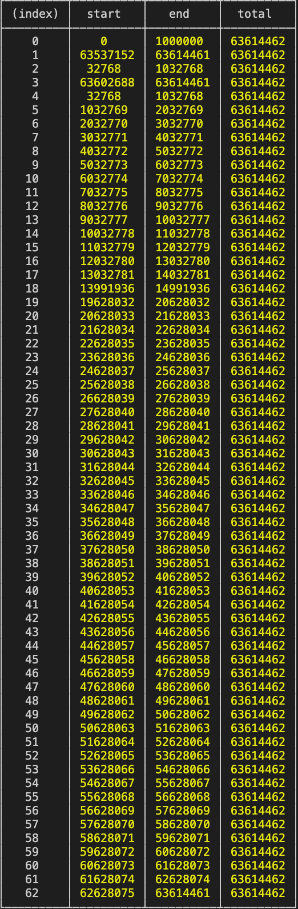

# Day: 21st May 2021

## How to write your own video-streaming server?
Using html `<video>` tag we can send send request to fetch video. But how we can send video type from node js server?

Using `<video>`

## Git commands:
* To change `user.name` and `user.email` for next upcoming commits use command `git config user.email <email>` and `git config user.name <username>`. Doing this will only update the commit author name and email address for current repositories. For updating commit author name and email use flag `--global` or `git config --global user.name <user name>` and `git config --global user.email <user.email>`.
* To edit commit past commit message we can use command `git commit --amend`. This will open editor.
* To edit last commit author name use command `git commit --amend --author="username <email>"`

## Questions?
* How `HTML source tag` works? Image below shows the request log done by source tag. 

* 
* System design of Youtube?
* 

## Credits for the day :)
* [Coding HTTP Video Streaming Server In Nodejs](https://www.youtube.com/watch?v=ZjBLbXUuyWg)